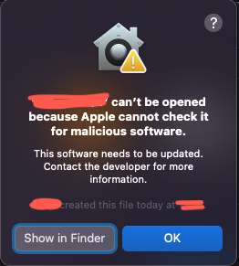

## How to disable Gatekeeper

Basically, I was trying to install a third-party app developed by one of my company colleagues, and I have faced with one of those warning(and frustrating) pop-ups sayng that "This App cannot be open because Apple cannot check it for malicious software"



After that, I have learned that Gatekeeper was preventing me to open it.
I have followed these simple steps as follows:

```bash
cd /Applications/Utilities
sudo spctl --master-disable
```

Now, the Anywhere option should be available under the Allow apps downloaded from section of System Preferences > Security & Privacy > General.


## Resources
- [How to Completely Disable Gatekeeper in macOS](https://www.makeuseof.com/how-to-disable-gatekeeper-mac/)
