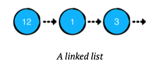

# Linked List

Chain of nodes

A linked list has the concept of a head and tail, which refers to the first and last nodes of the list respectively

Advantages:
- Constant Time insertion and removal from the front and back of the list
- Reliable perfomance characteristics

## Key Points
- Linked list are linear and unidirectional. As soon as you move a reference from one node to another, you can't go back
- **Copy-on-write** behavior lets you achieve value semantics.

## COW
- implement a duplicate or copy operation on modifiable resources
- if a resource is duplicated but not modified, it's not necessary to create a new resource, the resource can be shared between the copy and the original one

## Common Operations:
- push: Adds a value at the front of the list. This is also known as head-first insertion. 
- append: Adds a value at the end of the list. 
- insert(after:): Adds a value after a particular node of the list.
